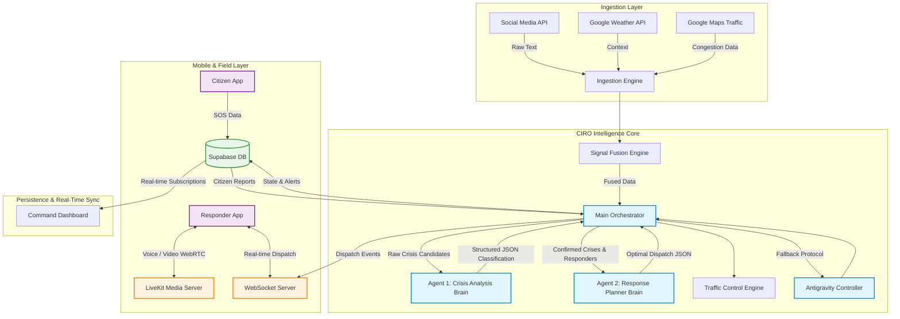

# CIRO - Crisis Intelligence & Response Orchestrator 🚨

CIRO is a hybrid real-time command center designed for crisis monitoring, resource allocation, and emergency reporting. It acts as an autonomous "brain" that ingests data from various sources, detects potential crises using AI, and intelligently dispatches emergency resources to mitigate the situation.

## Key Features

- **Multi-Source Signal Ingestion**: Continuously monitors social media feeds, live weather conditions, and traffic anomalies.
- **AI-Powered Crisis Detection**: Uses Google Gemini to classify and score potential incidents with high confidence.
- **Automated Resource Allocation**: Evaluates available emergency units (ambulances, police, fire trucks) and automatically dispatches them to optimal locations.
- **"Antigravity" Fallback System**: A deterministic orchestration engine that ensures the system remains stable and responsive even if AI services fail or are rate-limited.
- **Traffic Control & Rerouting**: Dynamically detects road congestion and generates reroute plans to keep rescue paths clear.
- **Real-Time Dashboard**: A Next.js web application that visualizes the state of the city, active crises, and dispatched units via Supabase real-time sync.

# CIRO Full System Architecture Deep-Dive 🧠📡

This document provides a comprehensive overview of the **CIRO (Crisis Intelligence & Response Orchestrator)** ecosystem, detailing the AI agent interactions, real-time communication protocols (WebRTC/LiveKit, WebSockets), and deterministic fallback systems.

## 🏗️ 1. Global Architecture Overview

CIRO is composed of three primary operational spaces:
1. **The Brain & Orchestrator (Next.js Serverless):** The core intelligence engine that processes signals, runs AI models, and dictates responses.
2. **The Field Responders & Citizens (Expo React Native Mobile App):** End-users generating SOS reports and first responders receiving dispatches and communicating via WebRTC voice.
3. **The Command Center (Next.js Web Dashboard):** The real-time visual interface for human operators.



## 🤖 2. The Multi-Agent AI System (Gemini)

Instead of relying on a single prompt, CIRO splits intelligence into specialized agentic nodes, making the outputs more reliable and structured.

### Agent 1: The Crisis Analysis Brain
- **Role:** Information classification and risk scoring.
- **Input:** Fused signals (social media text, weather severity, traffic congestion).
- **Process:** The agent evaluates the data and is constrained to output strict JSON. It determines if an event is a genuine crisis, categorizes it (e.g., `fire`, `accident`), calculates a severity score (`CRITICAL`, `HIGH`, `MEDIUM`), and predicts an affected radius.

### Agent 2: The Response Planner Brain
- **Role:** Logistics and resource allocation.
- **Input:** Confirmed crisis events from Agent 1, paired with the real-time locations and statuses of available emergency units.
- **Process:** Acts as a dispatcher. It evaluates ETAs, determines the optimal mix of units needed (e.g., 2 fire trucks, 1 ambulance), and generates a structured `AllocationPlan`.

## ⚖️ 3. The "Antigravity" Orchestrator

"Antigravity" is the deterministic control plane that wraps the AI agents. Large Language Models can hallucinate, rate-limit, or fail. Antigravity ensures CIRO never stops running.

- **State Management:** Maintains the unified state of the city in a tick-based cycle.
- **Heuristic Fallback:** If the Gemini API fails, Antigravity intercepts the error and applies hard-coded heuristic rules (e.g., "If social media mentions fire > 5 times, dispatch 1 fire unit and 1 police unit").
- **State Reconciliation:** Prevents duplicate crisis generation and ages out old crises mathematically, independent of the AI.

## ⚡ 4. Real-Time Communications & WebRTC

To coordinate field responders, CIRO bypasses standard HTTP request-response delays for critical operations.

### WebSockets for Dispatch
- The Orchestrator pushes dispatch commands via a dedicated **WebSocket connection**.
- When the Response Planner Brain allocates an ambulance, the Orchestrator fires an event over WebSockets (`wss://webrtc-...`).
- The Mobile App receives this instantly, triggering an alarm/dispatch notification for the first responder without waiting for database polling.

### LiveKit (WebRTC) for Voice & Audio
- The mobile application integrates **LiveKit**, a powerful open-source WebRTC media server.
- This provides ultra-low latency push-to-talk (PTT) voice channels and potential video streaming between command center operators and field responders.
- Unlike text, which can be slow to type during an emergency, WebRTC allows instant verbal coordination linked directly to the active `CrisisEvent` ID.

## 💾 5. Persistence & Cross-Platform Sync

- **Supabase Realtime:** Acts as the central nervous system for state.
- **Citizen SOS:** When a citizen uses the React Native app to report an emergency, it's written directly to Supabase.
- **Tick Ingestion:** On the next orchestrator cycle (tick), the orchestrator fetches these unhandled active reports from Supabase and merges them with the social/weather signals.
- **Dashboard Reflection:** The Next.js Command Center dashboard subscribes to Supabase tables. The moment the Orchestrator updates a crisis status to `resolved` or dispatches a unit, the UI updates instantly across all connected screens.

##  How It Works

1. **Ingestion Layer (`ciro/lib/ingestion.ts`)**
   The system continuously pulls data from social media APIs, Google Weather, and Google Maps Traffic. This raw data serves as the foundation for identifying anomalies.

2. **Signal Fusion Engine**
   Raw signals are aggregated, grouped by location, and scored. The fusion engine correlates posts with weather and traffic to compute a `confidence_score` and `urgency_level` (e.g., `CRITICAL`, `HIGH`, `MEDIUM`), filtering out noise.

3. **AI-Powered Analysis (`ciro/lib/gemini.ts`)**
   - **Crisis Analysis Brain**: Evaluates urgent signals to definitively classify them as `CrisisEvents` (e.g., Fire, Accident), assigning severity and affected radius.
   - **Response Planner Brain**: Matches confirmed crises with available emergency resources, generating an optimal `AllocationPlan` with estimated arrival times.

4. **Main Orchestrator & "Antigravity" (`ciro/lib/orchestrator.ts`)**
   Runs on a continuous cycle to track the state of the city. The **Antigravity Protocol** is a deterministic control plane that ensures stability. If the AI models fail, the orchestrator seamlessly falls back to heuristic rules (e.g., standard dispatch of 1 ambulance and 1 police unit for accidents), ensuring zero downtime.

5. **Traffic Control Engine**
   Computes road states around active crises, issuing automatic road blocks and rerouting recommendations to clear the path for first responders.

6. **Persistence & Synchronization (`ciro/lib/supabase.ts`)**
   All state transitions, dispatch logs, and notifications are persisted to Supabase. The Next.js dashboard uses real-time channels to instantly reflect the live situation.

##  Getting Started

### Prerequisites
- Node.js (v18+)
- A Supabase Project
- API Keys for Google Gemini, Google Maps, and Google Weather

### 1. Installation

Clone the repository and install dependencies:
```bash
git clone https://github.com/your-username/ciro.git
cd ciro/ciro
npm install
```

### 2. Environment Variables

Create a `.env` file in the `ciro/` directory with the following variables:

```env
NEXT_PUBLIC_SUPABASE_URL=https://<your-supabase>.supabase.co
NEXT_PUBLIC_SUPABASE_ANON_KEY=<anon-key>

GEMINI_API_KEY=<gemini-key>
GOOGLE_WEATHER_API_KEY=<google-weather-key>
NEXT_PUBLIC_GOOGLE_MAPS_KEY=<google-maps-key>

NEXT_PUBLIC_SOCIAL_API=https://social-media-post-cquv.onrender.com

PREFER_OPENROUTER=false
OPENROUTER_API_KEY=<openrouter-key>
OPENROUTER_MODEL=deepseek/deepseek-v4-flash:free
```

### 3. Database Setup

Provision your Supabase database by running the SQL script located at `ciro/supabase/schema.sql` in your Supabase SQL Editor.

### 4. Running the Application

Start the development server:
```bash
npm run dev
```

The CIRO dashboard will be available at `http://localhost:3000`.

##  Privacy & Security Notes
- **Data Anonymization:** CIRO ingests social data with location context. Ensure that sensitive personal data is filtered and anonymized in any production deployment.
- **Authentication:** The current demo uses the Supabase anon key for dashboard sync. Production deployments require authenticated access and properly configured Row-Level Security (RLS) policies.

## Contributing
Contributions are welcome! Please feel free to submit a Pull Request or open an Issue for bug fixes and feature requests.

##  License
This project is licensed under the MIT License.
