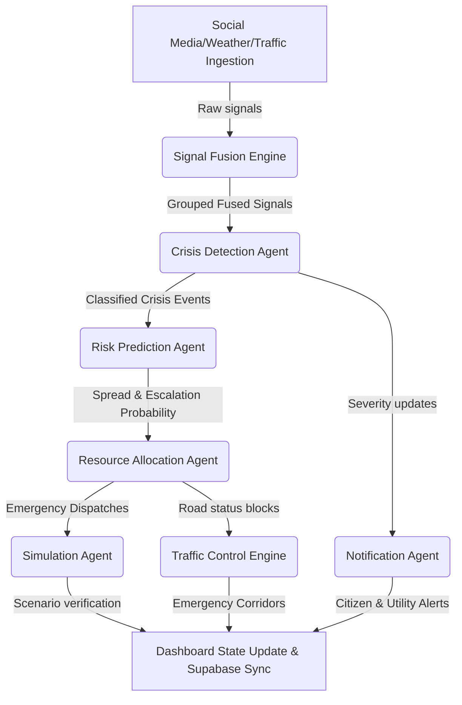

# CIRO System Diagnostics & Health Report
Generated on: 2026-05-19T12:43:40.835Z

## 1. Environment Configurations
| Variable Name | Status | Configured Value | Severity |
| --- | --- | --- | --- |
| `GEMINI_API_KEY` | 🟢 Configured | `AIzaSy...MyOc` | High (Required) |
| `NEXT_PUBLIC_GOOGLE_MAPS_KEY` | 🟢 Configured | `AIzaSy...HGI0` | High (Required) |
| `GOOGLE_WEATHER_API_KEY` | 🟢 Configured | `AIzaSy...v8qs` | Low (Optional) |
| `NEXT_PUBLIC_SOCIAL_API` | 🟢 Configured | `https://social-media-post-cquv.onrender.com` | Low (Optional) |
| `NEXT_PUBLIC_SUPABASE_URL` | 🟢 Configured | `https://gbschepxsnjiygrdmhnm.supabase.co` | High (Required) |
| `NEXT_PUBLIC_SUPABASE_ANON_KEY` | 🟢 Configured | `eyJhbG...DQYU` | High (Required) |

## 2. External Services & APIs Connectivity
| Endpoint | Description | Status | Latency | Details |
| --- | --- | --- | --- | --- |
| Social Media API | Ingests real-time simulated posts | 🟢 Connected | 468ms | Successfully loaded 5 incident reports |
| Google Maps API | Location Geocoding & Emergency Routing | 🟢 Key Format Valid | N/A | Key starts with valid prefix 'AIzaSy' |
| Google Weather API | Micro-climate Signal Contextualization | 🟢 Key Configured | N/A | Custom Weather API key provided |

## 3. Google Gemini Large Language Models
| Model ID | Target Agent | Connection Status | Latency | Output Preview |
| --- | --- | --- | --- | --- |
| gemini-2.5-flash | Multi-agent Orchestration | 🔴 Connection Failed | N/A | Gemini: [GoogleGenerativeAI Error]: Error fetching from https://generativelanguage.googleapis.com/v1beta/models/gemini-2.5-flash:generateContent: [429 Too Many Requests] You exceeded your current quota, please check your plan and billing details. For more information on this error, head to: https://ai.google.dev/gemini-api/docs/rate-limits. To monitor your current usage, head to: https://ai.dev/rate-limit. 
* Quota exceeded for metric: generativelanguage.googleapis.com/generate_content_free_tier_requests, limit: 20, model: gemini-2.5-flash
Please retry in 13.514559641s. [{"@type":"type.googleapis.com/google.rpc.Help","links":[{"description":"Learn more about Gemini API quotas","url":"https://ai.google.dev/gemini-api/docs/rate-limits"}]},{"@type":"type.googleapis.com/google.rpc.QuotaFailure","violations":[{"quotaMetric":"generativelanguage.googleapis.com/generate_content_free_tier_requests","quotaId":"GenerateRequestsPerDayPerProjectPerModel-FreeTier","quotaDimensions":{"location":"global","model":"gemini-2.5-flash"},"quotaValue":"20"}]},{"@type":"type.googleapis.com/google.rpc.RetryInfo","retryDelay":"13s"}]. OpenRouter: Request failed with status code 429 |
| gemma-4-26b-a4b-it | Signal Summarization fallback | 🟢 Online | 9231ms | Available |

## 4. Supabase Database & Persistence Health
| Table Name | Expected Purpose | Exists in DB | Schema & Realtime Status | Action |
| --- | --- | --- | --- | --- |
| `ciro_cycles` | Saves run metrics & cycle count | 🟢 Active | Verified OK (437ms) | Fully Synchronized |
| `ciro_logs` | Stores deep AI agent decision chains | 🟢 Active | Verified OK (304ms) | Fully Synchronized |
| `ciro_crises` | Registers active & historical crisis signals | 🟢 Active | Verified OK (341ms) | Fully Synchronized |
| `ciro_allocations` | Records dispatched resource logistics | 🟢 Active | Verified OK (293ms) | Fully Synchronized |
| `ciro_notifications` | Preserves citizen & utility alerts | 🟢 Active | Verified OK (286ms) | Fully Synchronized |

## 5. Agentic Orchestrator Dry-Run Trace
🟢 **Orchestrator Cycle Dry-Run Succeeded** in **88672ms**!

### Core Metrics:
- **System State Status**: `CRITICAL`
- **Ingested Signals**: `20`
- **Detected Active Crises**: `3` event(s)
- **Dispatched Resources**: `3` allocation plan(s)
- **Generated Alerts**: `3` alert message(s)
- **Simulation Runs**: `0` virtual crisis outcome(s)
- **Traffic Corridors Rerouted/Blocked**: `3` zone(s)

### Dry-Run Active Crises:
| ID | Type | Severity | Location | Radii | Description |
| --- | --- | --- | --- | --- | --- |
| `crisis_1779194676612_ao5xx` | FIRE | **CRITICAL** | Tariq Road | 2 km | Just saw a terrible blaze at Tariq Road. Stay safe everyone! #Karachi #fire |
| `crisis_1779194677642_aj1j2` | FIRE | **CRITICAL** | Keamari | 2 km | Just saw a terrible huge smoke at Keamari. Stay safe everyone! #Karachi #fire |
| `crisis_1779194677021_viiod` | FIRE | **CRITICAL** | Johar Mor | 2 km | Just saw a terrible burning at Johar Mor. Stay safe everyone! #Karachi #fire |

### Dry-Run Dispatch Allocations:
| Target Crisis ID | ETA | Units Dispatched | Allocation Strategy |
| --- | --- | --- | --- |
| `crisis_1779194676612_ao5xx` | 12 mins | `ambulance_1 (ambulance)`, `ambulance_2 (ambulance)`, `ambulance_3 (ambulance)` | Standard allocation for fire |
| `crisis_1779194677642_aj1j2` | 12 mins | `ambulance_1 (ambulance)`, `ambulance_2 (ambulance)`, `ambulance_3 (ambulance)` | Standard allocation for fire |
| `crisis_1779194677021_viiod` | 12 mins | `ambulance_1 (ambulance)`, `ambulance_2 (ambulance)`, `ambulance_3 (ambulance)` | Standard allocation for fire |

### Dry-Run Broadcast Alerts:
| Channel | Severity | Title | Message |
| --- | --- | --- | --- |
| `PUBLIC` | CRITICAL | **CRITICAL Alert: FIRE at Tariq Road** | Emergency reported at Tariq Road. Just saw a terrible blaze at Tariq Road. Stay safe everyone! #Karachi #fire |
| `PUBLIC` | CRITICAL | **CRITICAL Alert: FIRE at Keamari** | Emergency reported at Keamari. Just saw a terrible huge smoke at Keamari. Stay safe everyone! #Karachi #fire |
| `PUBLIC` | CRITICAL | **CRITICAL Alert: FIRE at Johar Mor** | Emergency reported at Johar Mor. Just saw a terrible burning at Johar Mor. Stay safe everyone! #Karachi #fire |

## 6. Real-Time Agent Logger & Decision Stats
### In-Memory Logger Metrics:
- **Total Compiled Logs**: `90`
- **Errors Registered**: `15`
- **API Outbound Calls**: `72`
- **Average Outbound API Latency**: `10520 ms`

### Log Breakdown by Level:
| Log Level | Counts |
| --- | --- |
| **SUCCESS** | 6 |
| **INFO** | 42 |
| **WARN** | 27 |
| **ERROR** | 15 |

### Log Breakdown by Agent / Engine:
| Agent / Engine | Counts |
| --- | --- |
| `Orchestrator` | 8 |
| `TrafficControlEngine` | 2 |
| `ResponsePlannerBrain` | 36 |
| `CrisisAnalysisBrain` | 36 |
| `SignalFusionEngine` | 2 |
| `WeatherIngestionAgent` | 2 |
| `TrafficIngestionAgent` | 2 |
| `SocialIngestionAgent` | 2 |

### Log Breakdown by Category:
| Category | Counts |
| --- | --- |
| `ORCHESTRATOR` | 2 |
| `TRAFFIC_CONTROL` | 2 |
| `RESPONSE_PLANNER` | 6 |
| `API_CALL` | 72 |
| `CRISIS_DETECTION` | 3 |
| `CRISIS_ANALYSIS` | 3 |
| `SIGNAL_FUSION` | 2 |

### Live Chronological Audit Log (Top 30):
| Timestamp | Level | Agent | Action | Message | Details |
| --- | --- | --- | --- | --- | --- |
| 5:45:27 PM | `SUCCESS` | `Orchestrator` | `CYCLE_END` | === Cycle #1 complete in 88668ms — status: CRITICAL | 3 active crises, 3 alerts === | Latency: 88668ms |
| 5:45:27 PM | `SUCCESS` | `TrafficControlEngine` | `UPDATE_ROADS` | 3 roads blocked, 0 rerouted | - |
| 5:45:27 PM | `INFO` | `TrafficControlEngine` | `UPDATE_ROADS` | Recalculating road states for 3 active crises | - |
| 5:45:26 PM | `WARN` | `Orchestrator` | `PLAN_FALLBACK` | Unified planning failed for crisis_1779194677021_viiod: Error: [GoogleGenerativeAI Error]: Error fetching from https://generativelanguage.googleapis.com/v1beta/models/gemini-2.5-flash:generateContent: [429 Too Many Requests] You exceeded your current quota, please check your plan and billing details. For more information on this error, head to: https://ai.google.dev/gemini-api/docs/rate-limits. To monitor your current usage, head to: https://ai.dev/rate-limit. 
* Quota exceeded for metric: generativelanguage.googleapis.com/generate_content_free_tier_requests, limit: 20, model: gemini-2.5-flash
Please retry in 33.706646028s. [{"@type":"type.googleapis.com/google.rpc.Help","links":[{"description":"Learn more about Gemini API quotas","url":"https://ai.google.dev/gemini-api/docs/rate-limits"}]},{"@type":"type.googleapis.com/google.rpc.QuotaFailure","violations":[{"quotaMetric":"generativelanguage.googleapis.com/generate_content_free_tier_requests","quotaId":"GenerateRequestsPerDayPerProjectPerModel-FreeTier","quotaDimensions":{"location":"global","model":"gemini-2.5-flash"},"quotaValue":"20"}]},{"@type":"type.googleapis.com/google.rpc.RetryInfo","retryDelay":"33s"}] — using heuristics | Error: [GoogleGenerativeAI Error]: Error fetching from https://generativelanguage.googleapis.com/v1beta/models/gemini-2.5-flash:generateContent: [429 Too Many Requests] You exceeded your current quota, please check your plan and billing details. For more information on this error, head to: https://ai.google.dev/gemini-api/docs/rate-limits. To monitor your current usage, head to: https://ai.dev/rate-limit. 
* Quota exceeded for metric: generativelanguage.googleapis.com/generate_content_free_tier_requests, limit: 20, model: gemini-2.5-flash
Please retry in 33.706646028s. [{"@type":"type.googleapis.com/google.rpc.Help","links":[{"description":"Learn more about Gemini API quotas","url":"https://ai.google.dev/gemini-api/docs/rate-limits"}]},{"@type":"type.googleapis.com/google.rpc.QuotaFailure","violations":[{"quotaMetric":"generativelanguage.googleapis.com/generate_content_free_tier_requests","quotaId":"GenerateRequestsPerDayPerProjectPerModel-FreeTier","quotaDimensions":{"location":"global","model":"gemini-2.5-flash"},"quotaValue":"20"}]},{"@type":"type.googleapis.com/google.rpc.RetryInfo","retryDelay":"33s"}] |
| 5:45:26 PM | `ERROR` | `ResponsePlannerBrain` | `PLAN` | Fallback OpenRouter also failed: AxiosError: Request failed with status code 429 | - |
| 5:45:26 PM | `INFO` | `ResponsePlannerBrain` | `PLAN` | → OpenRouter (deepseek/deepseek-v4-flash:free): "Formulate an emergency response plan, simulate the outcome, and generate alerts. Return JSON only.  Crisis Profile: - Ty..." | - |
| 5:45:26 PM | `WARN` | `ResponsePlannerBrain` | `PLAN` | Primary Gemini failed. Trying fallback OpenRouter... | - |
| 5:45:26 PM | `ERROR` | `ResponsePlannerBrain` | `PLAN` | ✗ Gemini call failed after 241ms: Error: [GoogleGenerativeAI Error]: Error fetching from https://generativelanguage.googleapis.com/v1beta/models/gemini-2.5-flash:generateContent: [429 Too Many Requests] You exceeded your current quota, please check your plan and billing details. For more information on this error, head to: https://ai.google.dev/gemini-api/docs/rate-limits. To monitor your current usage, head to: https://ai.dev/rate-limit. 
* Quota exceeded for metric: generativelanguage.googleapis.com/generate_content_free_tier_requests, limit: 20, model: gemini-2.5-flash
Please retry in 33.706646028s. [{"@type":"type.googleapis.com/google.rpc.Help","links":[{"description":"Learn more about Gemini API quotas","url":"https://ai.google.dev/gemini-api/docs/rate-limits"}]},{"@type":"type.googleapis.com/google.rpc.QuotaFailure","violations":[{"quotaMetric":"generativelanguage.googleapis.com/generate_content_free_tier_requests","quotaId":"GenerateRequestsPerDayPerProjectPerModel-FreeTier","quotaDimensions":{"location":"global","model":"gemini-2.5-flash"},"quotaValue":"20"}]},{"@type":"type.googleapis.com/google.rpc.RetryInfo","retryDelay":"33s"}] | Latency: 241ms |
| 5:45:26 PM | `INFO` | `ResponsePlannerBrain` | `PLAN` | → Gemini 2.5 Flash: "Formulate an emergency response plan, simulate the outcome, and generate alerts. Return JSON only.  Crisis Profile: - Ty..." | - |
| 5:45:22 PM | `WARN` | `Orchestrator` | `PLAN_FALLBACK` | Unified planning failed for crisis_1779194677642_aj1j2: Error: [GoogleGenerativeAI Error]: Error fetching from https://generativelanguage.googleapis.com/v1beta/models/gemini-2.5-flash:generateContent: [429 Too Many Requests] You exceeded your current quota, please check your plan and billing details. For more information on this error, head to: https://ai.google.dev/gemini-api/docs/rate-limits. To monitor your current usage, head to: https://ai.dev/rate-limit. 
* Quota exceeded for metric: generativelanguage.googleapis.com/generate_content_free_tier_requests, limit: 20, model: gemini-2.5-flash
Please retry in 37.597502508s. [{"@type":"type.googleapis.com/google.rpc.Help","links":[{"description":"Learn more about Gemini API quotas","url":"https://ai.google.dev/gemini-api/docs/rate-limits"}]},{"@type":"type.googleapis.com/google.rpc.QuotaFailure","violations":[{"quotaMetric":"generativelanguage.googleapis.com/generate_content_free_tier_requests","quotaId":"GenerateRequestsPerDayPerProjectPerModel-FreeTier","quotaDimensions":{"location":"global","model":"gemini-2.5-flash"},"quotaValue":"20"}]},{"@type":"type.googleapis.com/google.rpc.RetryInfo","retryDelay":"37s"}] — using heuristics | Error: [GoogleGenerativeAI Error]: Error fetching from https://generativelanguage.googleapis.com/v1beta/models/gemini-2.5-flash:generateContent: [429 Too Many Requests] You exceeded your current quota, please check your plan and billing details. For more information on this error, head to: https://ai.google.dev/gemini-api/docs/rate-limits. To monitor your current usage, head to: https://ai.dev/rate-limit. 
* Quota exceeded for metric: generativelanguage.googleapis.com/generate_content_free_tier_requests, limit: 20, model: gemini-2.5-flash
Please retry in 37.597502508s. [{"@type":"type.googleapis.com/google.rpc.Help","links":[{"description":"Learn more about Gemini API quotas","url":"https://ai.google.dev/gemini-api/docs/rate-limits"}]},{"@type":"type.googleapis.com/google.rpc.QuotaFailure","violations":[{"quotaMetric":"generativelanguage.googleapis.com/generate_content_free_tier_requests","quotaId":"GenerateRequestsPerDayPerProjectPerModel-FreeTier","quotaDimensions":{"location":"global","model":"gemini-2.5-flash"},"quotaValue":"20"}]},{"@type":"type.googleapis.com/google.rpc.RetryInfo","retryDelay":"37s"}] |
| 5:45:22 PM | `ERROR` | `ResponsePlannerBrain` | `PLAN` | Fallback OpenRouter also failed: AxiosError: Request failed with status code 429 | - |
| 5:45:22 PM | `INFO` | `ResponsePlannerBrain` | `PLAN` | → OpenRouter (deepseek/deepseek-v4-flash:free): "Formulate an emergency response plan, simulate the outcome, and generate alerts. Return JSON only.  Crisis Profile: - Ty..." | - |
| 5:45:22 PM | `WARN` | `ResponsePlannerBrain` | `PLAN` | Primary Gemini failed. Trying fallback OpenRouter... | - |
| 5:45:22 PM | `ERROR` | `ResponsePlannerBrain` | `PLAN` | ✗ Gemini call failed after 416ms: Error: [GoogleGenerativeAI Error]: Error fetching from https://generativelanguage.googleapis.com/v1beta/models/gemini-2.5-flash:generateContent: [429 Too Many Requests] You exceeded your current quota, please check your plan and billing details. For more information on this error, head to: https://ai.google.dev/gemini-api/docs/rate-limits. To monitor your current usage, head to: https://ai.dev/rate-limit. 
* Quota exceeded for metric: generativelanguage.googleapis.com/generate_content_free_tier_requests, limit: 20, model: gemini-2.5-flash
Please retry in 37.597502508s. [{"@type":"type.googleapis.com/google.rpc.Help","links":[{"description":"Learn more about Gemini API quotas","url":"https://ai.google.dev/gemini-api/docs/rate-limits"}]},{"@type":"type.googleapis.com/google.rpc.QuotaFailure","violations":[{"quotaMetric":"generativelanguage.googleapis.com/generate_content_free_tier_requests","quotaId":"GenerateRequestsPerDayPerProjectPerModel-FreeTier","quotaDimensions":{"location":"global","model":"gemini-2.5-flash"},"quotaValue":"20"}]},{"@type":"type.googleapis.com/google.rpc.RetryInfo","retryDelay":"37s"}] | Latency: 416ms |
| 5:45:22 PM | `INFO` | `ResponsePlannerBrain` | `PLAN` | → Gemini 2.5 Flash: "Formulate an emergency response plan, simulate the outcome, and generate alerts. Return JSON only.  Crisis Profile: - Ty..." | - |
| 5:45:18 PM | `WARN` | `Orchestrator` | `PLAN_FALLBACK` | Unified planning failed for crisis_1779194676612_ao5xx: Error: [GoogleGenerativeAI Error]: Error fetching from https://generativelanguage.googleapis.com/v1beta/models/gemini-2.5-flash:generateContent: [429 Too Many Requests] You exceeded your current quota, please check your plan and billing details. For more information on this error, head to: https://ai.google.dev/gemini-api/docs/rate-limits. To monitor your current usage, head to: https://ai.dev/rate-limit. 
* Quota exceeded for metric: generativelanguage.googleapis.com/generate_content_free_tier_requests, limit: 20, model: gemini-2.5-flash
Please retry in 42.352794825s. [{"@type":"type.googleapis.com/google.rpc.Help","links":[{"description":"Learn more about Gemini API quotas","url":"https://ai.google.dev/gemini-api/docs/rate-limits"}]},{"@type":"type.googleapis.com/google.rpc.QuotaFailure","violations":[{"quotaMetric":"generativelanguage.googleapis.com/generate_content_free_tier_requests","quotaId":"GenerateRequestsPerDayPerProjectPerModel-FreeTier","quotaDimensions":{"location":"global","model":"gemini-2.5-flash"},"quotaValue":"20"}]},{"@type":"type.googleapis.com/google.rpc.RetryInfo","retryDelay":"42s"}] — using heuristics | Error: [GoogleGenerativeAI Error]: Error fetching from https://generativelanguage.googleapis.com/v1beta/models/gemini-2.5-flash:generateContent: [429 Too Many Requests] You exceeded your current quota, please check your plan and billing details. For more information on this error, head to: https://ai.google.dev/gemini-api/docs/rate-limits. To monitor your current usage, head to: https://ai.dev/rate-limit. 
* Quota exceeded for metric: generativelanguage.googleapis.com/generate_content_free_tier_requests, limit: 20, model: gemini-2.5-flash
Please retry in 42.352794825s. [{"@type":"type.googleapis.com/google.rpc.Help","links":[{"description":"Learn more about Gemini API quotas","url":"https://ai.google.dev/gemini-api/docs/rate-limits"}]},{"@type":"type.googleapis.com/google.rpc.QuotaFailure","violations":[{"quotaMetric":"generativelanguage.googleapis.com/generate_content_free_tier_requests","quotaId":"GenerateRequestsPerDayPerProjectPerModel-FreeTier","quotaDimensions":{"location":"global","model":"gemini-2.5-flash"},"quotaValue":"20"}]},{"@type":"type.googleapis.com/google.rpc.RetryInfo","retryDelay":"42s"}] |
| 5:45:18 PM | `ERROR` | `ResponsePlannerBrain` | `PLAN` | Fallback OpenRouter also failed: AxiosError: Request failed with status code 429 | - |
| 5:45:17 PM | `INFO` | `ResponsePlannerBrain` | `PLAN` | → OpenRouter (deepseek/deepseek-v4-flash:free): "Formulate an emergency response plan, simulate the outcome, and generate alerts. Return JSON only.  Crisis Profile: - Ty..." | - |
| 5:45:17 PM | `WARN` | `ResponsePlannerBrain` | `PLAN` | Primary Gemini failed. Trying fallback OpenRouter... | - |
| 5:45:17 PM | `ERROR` | `ResponsePlannerBrain` | `PLAN` | ✗ Gemini call failed after 452ms: Error: [GoogleGenerativeAI Error]: Error fetching from https://generativelanguage.googleapis.com/v1beta/models/gemini-2.5-flash:generateContent: [429 Too Many Requests] You exceeded your current quota, please check your plan and billing details. For more information on this error, head to: https://ai.google.dev/gemini-api/docs/rate-limits. To monitor your current usage, head to: https://ai.dev/rate-limit. 
* Quota exceeded for metric: generativelanguage.googleapis.com/generate_content_free_tier_requests, limit: 20, model: gemini-2.5-flash
Please retry in 42.352794825s. [{"@type":"type.googleapis.com/google.rpc.Help","links":[{"description":"Learn more about Gemini API quotas","url":"https://ai.google.dev/gemini-api/docs/rate-limits"}]},{"@type":"type.googleapis.com/google.rpc.QuotaFailure","violations":[{"quotaMetric":"generativelanguage.googleapis.com/generate_content_free_tier_requests","quotaId":"GenerateRequestsPerDayPerProjectPerModel-FreeTier","quotaDimensions":{"location":"global","model":"gemini-2.5-flash"},"quotaValue":"20"}]},{"@type":"type.googleapis.com/google.rpc.RetryInfo","retryDelay":"42s"}] | Latency: 452ms |
| 5:45:17 PM | `INFO` | `ResponsePlannerBrain` | `PLAN` | → Gemini 2.5 Flash: "Formulate an emergency response plan, simulate the outcome, and generate alerts. Return JSON only.  Crisis Profile: - Ty..." | - |
| 5:45:09 PM | `WARN` | `ResponsePlannerBrain` | `PLAN` | Rate limited (429) on Gemini. Retrying in 16.7s... (Attempt 3/3) | - |
| 5:45:09 PM | `INFO` | `ResponsePlannerBrain` | `PLAN` | → Gemini 2.5 Flash: "Formulate an emergency response plan, simulate the outcome, and generate alerts. Return JSON only.  Crisis Profile: - Ty..." | - |
| 5:45:05 PM | `WARN` | `ResponsePlannerBrain` | `PLAN` | Rate limited (429) on Gemini. Retrying in 17.0s... (Attempt 3/3) | - |
| 5:45:04 PM | `INFO` | `ResponsePlannerBrain` | `PLAN` | → Gemini 2.5 Flash: "Formulate an emergency response plan, simulate the outcome, and generate alerts. Return JSON only.  Crisis Profile: - Ty..." | - |
| 5:45:01 PM | `WARN` | `ResponsePlannerBrain` | `PLAN` | Rate limited (429) on Gemini. Retrying in 16.1s... (Attempt 3/3) | - |
| 5:45:00 PM | `INFO` | `ResponsePlannerBrain` | `PLAN` | → Gemini 2.5 Flash: "Formulate an emergency response plan, simulate the outcome, and generate alerts. Return JSON only.  Crisis Profile: - Ty..." | - |
| 5:44:57 PM | `WARN` | `ResponsePlannerBrain` | `PLAN` | Rate limited (429) on Gemini. Retrying in 11.9s... (Attempt 2/3) | - |
| 5:44:56 PM | `INFO` | `ResponsePlannerBrain` | `PLAN` | → Gemini 2.5 Flash: "Formulate an emergency response plan, simulate the outcome, and generate alerts. Return JSON only.  Crisis Profile: - Ty..." | - |
| 5:44:53 PM | `WARN` | `ResponsePlannerBrain` | `PLAN` | Rate limited (429) on Gemini. Retrying in 11.2s... (Attempt 2/3) | - |

## 7. Diagnostics Score Card
| Diagnostics Category | Status | Remarks |
| --- | --- | --- |
| Environment Setup | 🟢 PASS | Operational without bottlenecks |
| External Network Health | 🟢 PASS | Operational without bottlenecks |
| Gemini Models Interface | 🔴 FAIL | Requires developer attention |
| Supabase Database Schema | 🟢 PASS | Operational without bottlenecks |
| Orchestrator Cycle Run | 🟢 PASS | Operational without bottlenecks |

## 8. Architectural Overview
CIRO is structured as an **Agentic crisis response engine** with multiple independent specialized sub-agents working together in a unified pipeline:

