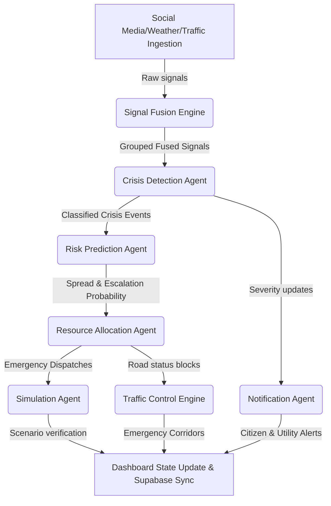

# CIRO System Diagnostics & Health Report
Generated on: 2026-05-17T10:31:35.931Z

## 1. Environment Configurations
| Variable Name | Status | Configured Value | Severity |
| --- | --- | --- | --- |
| `GEMINI_API_KEY` | 🔴 MISSING (Required) | `MISSING` | High (Required) |
| `NEXT_PUBLIC_GOOGLE_MAPS_KEY` | 🔴 MISSING (Required) | `MISSING` | High (Required) |
| `GOOGLE_WEATHER_API_KEY` | 🟡 MISSING (Optional) | `MISSING` | Low (Optional) |
| `NEXT_PUBLIC_SOCIAL_API` | 🟡 MISSING (Optional) | `N/A` | Low (Optional) |
| `NEXT_PUBLIC_SUPABASE_URL` | 🔴 MISSING (Required) | `N/A` | High (Required) |
| `NEXT_PUBLIC_SUPABASE_ANON_KEY` | 🔴 MISSING (Required) | `MISSING` | High (Required) |

## 2. External Services & APIs Connectivity
| Endpoint | Description | Status | Latency | Details |
| --- | --- | --- | --- | --- |
| Social Media API | Ingests real-time simulated posts | 🟢 Connected | 1103ms | Successfully loaded 5 incident reports |
| Google Maps API | Location Geocoding & Emergency Routing | 🔴 Key Invalid | N/A | Key is empty or lacks 'AIzaSy' prefix |
| Google Weather API | Micro-climate Signal Contextualization | 🟡 Not Configured (Fallback) | N/A | Using simulated high-fidelity weather generator |

## 3. Google Gemini Large Language Models
| Model ID | Target Agent | Connection Status | Latency | Output Preview |
| --- | --- | --- | --- | --- |
| gemini-2.5-flash | Multi-agent Orchestration | 🔴 Missing API Key | N/A | Cannot invoke models |

## 4. Supabase Database & Persistence Health
| Table Name | Expected Purpose | Exists in DB | Schema & Realtime Status | Action |
| --- | --- | --- | --- | --- |
| All Tables | Remote Event Logger & Dashboard Storage | ⚪ Not Configured | Running in high-performance local memory | Configure url/key in .env.local to persist cycles |

## 5. Agentic Orchestrator Dry-Run Trace
🟢 **Orchestrator Cycle Dry-Run Succeeded** in **249ms**!

### Core Metrics:
- **System State Status**: `CRITICAL`
- **Ingested Signals**: `19`
- **Detected Active Crises**: `3` event(s)
- **Dispatched Resources**: `3` allocation plan(s)
- **Generated Alerts**: `3` alert message(s)
- **Simulation Runs**: `0` virtual crisis outcome(s)
- **Traffic Corridors Rerouted/Blocked**: `3` zone(s)

### Dry-Run Active Crises:
| ID | Type | Severity | Location | Radii | Description |
| --- | --- | --- | --- | --- | --- |
| `crisis_1779013897283_6v8du` | FIRE | **CRITICAL** | Burns Road | 2 km | Emergency at Burns Road! Looks like a major fire brigade needed. Prayers for everyone involved. #Karachi |
| `crisis_1779013897283_xv3e2` | PROTEST | **HIGH** | Keamari | 2 km | Police and Ambulance rushing towards Keamari. Seems like a serious political rally. |
| `crisis_1779013897283_hi4ju` | ACCIDENT | **HIGH** | DHA | 2 km | Is it true about the ambulance needed at DHA? I have family there. |

### Dry-Run Dispatch Allocations:
| Target Crisis ID | ETA | Units Dispatched | Allocation Strategy |
| --- | --- | --- | --- |
| `crisis_1779013897283_6v8du` | 12 mins | `ambulance_1 (ambulance)`, `ambulance_2 (ambulance)`, `ambulance_3 (ambulance)` | Standard allocation for fire |
| `crisis_1779013897283_xv3e2` | 12 mins | `ambulance_1 (ambulance)`, `ambulance_2 (ambulance)`, `ambulance_3 (ambulance)` | Standard allocation for protest |
| `crisis_1779013897283_hi4ju` | 12 mins | `ambulance_1 (ambulance)`, `ambulance_2 (ambulance)`, `ambulance_3 (ambulance)` | Standard allocation for accident |

### Dry-Run Broadcast Alerts:
| Channel | Severity | Title | Message |
| --- | --- | --- | --- |
| `PUBLIC` | CRITICAL | **CRITICAL Alert: FIRE at Burns Road** | Emergency reported at Burns Road. Emergency at Burns Road! Looks like a major fire brigade needed. Prayers for everyone involved. #Karachi |
| `PUBLIC` | HIGH | **HIGH Alert: PROTEST at Keamari** | Emergency reported at Keamari. Police and Ambulance rushing towards Keamari. Seems like a serious political rally. |
| `PUBLIC` | HIGH | **HIGH Alert: ACCIDENT at DHA** | Emergency reported at DHA. Is it true about the ambulance needed at DHA? I have family there. |

## 6. Real-Time Agent Logger & Decision Stats
### In-Memory Logger Metrics:
- **Total Compiled Logs**: `38`
- **Errors Registered**: `9`
- **API Outbound Calls**: `18`
- **Average Outbound API Latency**: `246 ms`

### Log Breakdown by Level:
| Log Level | Counts |
| --- | --- |
| **SUCCESS** | 4 |
| **INFO** | 20 |
| **WARN** | 5 |
| **ERROR** | 9 |

### Log Breakdown by Agent / Engine:
| Agent / Engine | Counts |
| --- | --- |
| `Orchestrator` | 8 |
| `TrafficControlEngine` | 2 |
| `ResponsePlannerBrain` | 9 |
| `CrisisAnalysisBrain` | 9 |
| `SignalFusionEngine` | 2 |
| `SocialIngestionAgent` | 2 |
| `TrafficIngestionAgent` | 3 |
| `WeatherIngestionAgent` | 3 |

### Log Breakdown by Category:
| Category | Counts |
| --- | --- |
| `ORCHESTRATOR` | 2 |
| `TRAFFIC_CONTROL` | 2 |
| `RESPONSE_PLANNER` | 6 |
| `API_CALL` | 18 |
| `CRISIS_DETECTION` | 3 |
| `CRISIS_ANALYSIS` | 3 |
| `SIGNAL_FUSION` | 2 |
| `DATA_INGESTION` | 2 |

### Live Chronological Audit Log (Top 30):
| Timestamp | Level | Agent | Action | Message | Details |
| --- | --- | --- | --- | --- | --- |
| 3:31:37 PM | `SUCCESS` | `Orchestrator` | `CYCLE_END` | === Cycle #1 complete in 248ms — status: CRITICAL | 3 active crises, 3 alerts === | Latency: 248ms |
| 3:31:37 PM | `SUCCESS` | `TrafficControlEngine` | `UPDATE_ROADS` | 3 roads blocked, 0 rerouted | - |
| 3:31:37 PM | `INFO` | `TrafficControlEngine` | `UPDATE_ROADS` | Recalculating road states for 3 active crises | - |
| 3:31:37 PM | `WARN` | `Orchestrator` | `PLAN_FALLBACK` | Unified planning failed for crisis_1779013897283_hi4ju: Error: GEMINI_API_KEY not set — using heuristics | Error: GEMINI_API_KEY not set |
| 3:31:37 PM | `ERROR` | `ResponsePlannerBrain` | `PLAN` | ✗ Gemini call failed after 0ms: Error: GEMINI_API_KEY not set | Error: GEMINI_API_KEY not set |
| 3:31:37 PM | `INFO` | `ResponsePlannerBrain` | `PLAN` | → Gemini 2.5 Flash: "Formulate an emergency response plan, simulate the outcome, and generate alerts. Return JSON only.  Crisis Profile: - Ty..." | - |
| 3:31:37 PM | `INFO` | `ResponsePlannerBrain` | `PLAN` | Planning response for accident at DHA — 26 units available | - |
| 3:31:37 PM | `WARN` | `Orchestrator` | `PLAN_FALLBACK` | Unified planning failed for crisis_1779013897283_xv3e2: Error: GEMINI_API_KEY not set — using heuristics | Error: GEMINI_API_KEY not set |
| 3:31:37 PM | `ERROR` | `ResponsePlannerBrain` | `PLAN` | ✗ Gemini call failed after 0ms: Error: GEMINI_API_KEY not set | Error: GEMINI_API_KEY not set |
| 3:31:37 PM | `INFO` | `ResponsePlannerBrain` | `PLAN` | → Gemini 2.5 Flash: "Formulate an emergency response plan, simulate the outcome, and generate alerts. Return JSON only.  Crisis Profile: - Ty..." | - |
| 3:31:37 PM | `INFO` | `ResponsePlannerBrain` | `PLAN` | Planning response for protest at Keamari — 26 units available | - |
| 3:31:37 PM | `WARN` | `Orchestrator` | `PLAN_FALLBACK` | Unified planning failed for crisis_1779013897283_6v8du: Error: GEMINI_API_KEY not set — using heuristics | Error: GEMINI_API_KEY not set |
| 3:31:37 PM | `ERROR` | `ResponsePlannerBrain` | `PLAN` | ✗ Gemini call failed after 0ms: Error: GEMINI_API_KEY not set | Error: GEMINI_API_KEY not set |
| 3:31:37 PM | `INFO` | `ResponsePlannerBrain` | `PLAN` | → Gemini 2.5 Flash: "Formulate an emergency response plan, simulate the outcome, and generate alerts. Return JSON only.  Crisis Profile: - Ty..." | - |
| 3:31:37 PM | `INFO` | `ResponsePlannerBrain` | `PLAN` | Planning response for fire at Burns Road — 26 units available | - |
| 3:31:37 PM | `ERROR` | `Orchestrator` | `CLASSIFY_FALLBACK` | Gemini classification failed for accident@DHA: Error: GEMINI_API_KEY not set — using heuristic fallback | Error: GEMINI_API_KEY not set |
| 3:31:37 PM | `ERROR` | `CrisisAnalysisBrain` | `ANALYZE` | ✗ Gemini call failed after 0ms: Error: GEMINI_API_KEY not set | Error: GEMINI_API_KEY not set |
| 3:31:37 PM | `INFO` | `CrisisAnalysisBrain` | `ANALYZE` | → Gemini 2.5 Flash: "Analyze this emergency signal and predict its risks. Return a single JSON object.  Signal Details: - Hint Type: accident..." | - |
| 3:31:37 PM | `INFO` | `CrisisAnalysisBrain` | `ANALYZE` | Analyzing accident signal at DHA (conf: 0.79) | - |
| 3:31:37 PM | `ERROR` | `Orchestrator` | `CLASSIFY_FALLBACK` | Gemini classification failed for protest@Keamari: Error: GEMINI_API_KEY not set — using heuristic fallback | Error: GEMINI_API_KEY not set |
| 3:31:37 PM | `ERROR` | `CrisisAnalysisBrain` | `ANALYZE` | ✗ Gemini call failed after 0ms: Error: GEMINI_API_KEY not set | Error: GEMINI_API_KEY not set |
| 3:31:37 PM | `INFO` | `CrisisAnalysisBrain` | `ANALYZE` | → Gemini 2.5 Flash: "Analyze this emergency signal and predict its risks. Return a single JSON object.  Signal Details: - Hint Type: protest ..." | - |
| 3:31:37 PM | `INFO` | `CrisisAnalysisBrain` | `ANALYZE` | Analyzing protest signal at Keamari (conf: 0.81) | - |
| 3:31:37 PM | `ERROR` | `Orchestrator` | `CLASSIFY_FALLBACK` | Gemini classification failed for fire@Burns Road: Error: GEMINI_API_KEY not set — using heuristic fallback | Error: GEMINI_API_KEY not set |
| 3:31:37 PM | `ERROR` | `CrisisAnalysisBrain` | `ANALYZE` | ✗ Gemini call failed after 0ms: Error: GEMINI_API_KEY not set | Error: GEMINI_API_KEY not set |
| 3:31:37 PM | `INFO` | `CrisisAnalysisBrain` | `ANALYZE` | → Gemini 2.5 Flash: "Analyze this emergency signal and predict its risks. Return a single JSON object.  Signal Details: - Hint Type: fire - L..." | - |
| 3:31:37 PM | `INFO` | `CrisisAnalysisBrain` | `ANALYZE` | Analyzing fire signal at Burns Road (conf: 0.58) | - |
| 3:31:37 PM | `SUCCESS` | `SignalFusionEngine` | `FUSE` | Fused 19 signals: 1 CRITICAL, 6 HIGH — top 6 queued for AI | - |
| 3:31:37 PM | `INFO` | `SignalFusionEngine` | `FUSE` | Fusing 20 posts + weather + 10 traffic zones | - |
| 3:31:37 PM | `SUCCESS` | `SocialIngestionAgent` | `FETCH_POSTS` | Received 20 posts (244ms) | Latency: 244ms |

## 7. Diagnostics Score Card
| Diagnostics Category | Status | Remarks |
| --- | --- | --- |
| Environment Setup | 🔴 FAIL | Requires developer attention |
| External Network Health | 🔴 FAIL | Requires developer attention |
| Gemini Models Interface | 🔴 FAIL | Requires developer attention |
| Supabase Database Schema | 🔴 FAIL | Requires developer attention |
| Orchestrator Cycle Run | 🟢 PASS | Operational without bottlenecks |

## 8. Architectural Overview
CIRO is structured as an **Agentic crisis response engine** with multiple independent specialized sub-agents working together in a unified pipeline:

